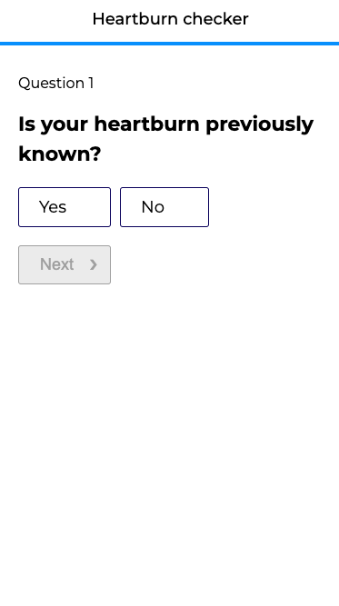
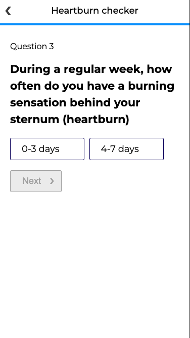

# Health Questionnaire
Questionnaire for medical appointments.

## Tech
- React
- CSS modules
- JavaScript

---

## Features
- selected option is highlighted
- next button is disabled and dimmed until you selected an option
- navigate forward with "next" button and backward with left arrow in header

---

## Implementation
Atomic design structure with reusable components. Making sure code is tidy and easy to read/understand.

---

## Components

#### Atoms
- Button
- Label
- Heading
- Radio

#### Molecules
- RadioWithLabel

#### Views
- Quesitonnaire    

---

## Functions

#### getQuestion    
Returns question (object) based on id
```javascript
function getQuestion() {
    return data.questions.filter(item => item.id === questionId)[0];
  }
```

#### handleSelection   
Clickhandler, sets answer (string) and score (number)
```javascript
function handleSelection(id, value) {
    setAnswer(id);
    setScore(value);
  }
```

#### handleQuestionId   
Finding next question id, iterating over -next- array. If conditional, take answer into account, else just get id.

```javascript
function handleQuestionId(answer) {
    let id = '';
    const question = getQuestion();

    question?.next.map(item => {
      if (item.hasOwnProperty('answered')) {
        if (item.answered === answer) {
          id = item?.next_question;
        }
      } else {
        id = item?.next_question;
      }
    })
    setQuestionId(id);
  }
```
#### handleOutcome  
Calculating total score and finding correct outcome id based on score limits.

```javascript
function handleOutcome() {
    let sum = 0;
    let id = '';
    const values = Object.values(scores);
    const question = getQuestion(questionId);

    values.map(element => sum += element)

    question.next.forEach(item => {
      if (item.hasOwnProperty('max_score')) {
        if (item['max_score'] >= sum && !id) {
          id = item.outcome;
        }
      } else {
        if (!id) {
          id = item.outcome;
        }
      }
    })

	 const outcome = data.outcomes.filter(item => item.id === id)[0];
    setOutcome(outcome);
  }
```
#### handleRewind    
Removes score when going back one question and sets previous question id.

```javascript
function handleRewind() {
    if (Object.keys(scores).length > 1) {
      const keys = Object.keys(scores);
      delete scores[questionId]
      setQuestionId(keys[keys.length -2]);
    }
  }
```

#### handleForward  
Resets question answer and score when moving to next question. If last question handle outcome.

```javascript
function handleForward() {
    if (!isLastQuestion) {
      setAnswer(null);
      setScore(null);
      handleQuestionId(answer);
    } else {
      handleOutcome();
      setIsOutcome(true);
    }
  }
```

#### handleSummary  
At each question, checks if is last question in order to either show next question or outcome.

```javascript
 function handleSummary() {
    const question = getQuestion();
    const hasOutcome = question?.next.map(item => item.hasOwnProperty('outcome'));
    setIsLastQuestion(hasOutcome?.includes(true));
  }
```

#### handleReset  
Resetting everything when going back to start screen from summary screen.

```javascript
function handleReset() {
    setQuestionId(data.questions[0].id);
    setIsOutcome(false);
    setAnswer(null);
    setScores([]);
    setScore(null);
  }
```

#### renderOptions  
Renders options for each questions based on data.

```javascript
function renderOptions() {
    const question = getQuestion(questionId);

    return question?.answers.map((item, i) => {
        return (
          <RadioWithLabel
            id={item.id}
            item={item}
            key={i}
            value={item.score}
            handleSelection={handleSelection}
            checked={answer}
            text={item.label} />
        )
      })
  }
```
#### renderOutcome  
Renders summary page based on total score.

```javascript
function renderOutcome() {
    return (
      <div className={styles['summary-text']}>
        <h1 className={styles.thankyou}>
          Thank you for answering the questions!
        </h1>
        <p>{outcome?.text}</p>
        {outcome?.show_booking_button &&
          <div className={styles['meeting-btn']}>
            <Button text="Book a meeting" />
          </div>
        } 
        <p className={styles.restart} onClick={handleReset}>Back to the start screen</p>
      </div>
    )
  }
```

---

## Screenshots





