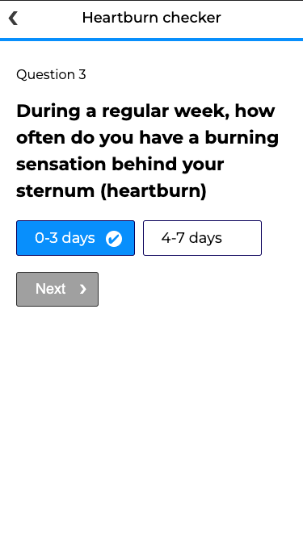

# Health Questionnaire
Questionnaire for medical appointments.

## Tech
- React
- CSS modules
- JavaScript

## Features
- selected option is highlighted
- next button is disabled and dimmed until you selected an option
- navigate forward with "next" button and backward with left arrow in header

## Implementation
Atomic design structure with reusable components.
Making sure code is tidy and easy to read/understand.

## Screenshots

